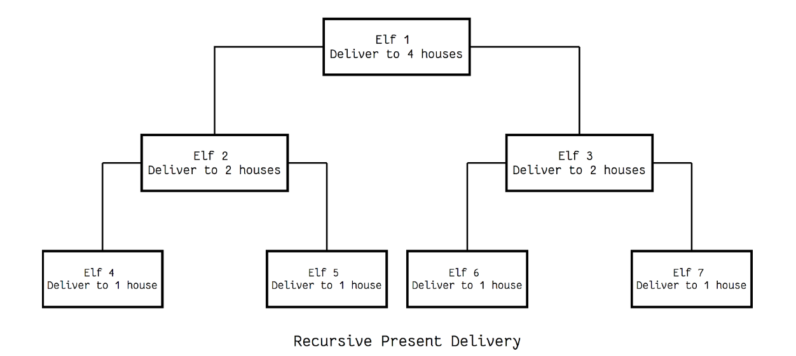

# Recursive Santa Claus

## Instructions

In the initial commit to this project, you have been provided with files that contain a JavaScript module and some associated tests. Currently the `deliverPresents` function is not implemented recursively causing the tests to fail. Use what we have learned to write a recursive solution to the problem of delivering presents.

## Provided Files

**.eslintrc.js** - a config file for eslint

**.gitignore** - this file sets the project up to ignore the node_modules folder when committing to git

**package.json** - this file sets up the Node project including all the dev dependencies

**santa.js** - this file contains the shell of the function for delivering presents

**tests.js** - this file contains tests for the `deliverPresents` function

## Problem Explanation
Let’s explore the concept of recursion with an exploration of Santa’s massive task of delivering presents to all the children of the world.

```javascript
function deliverPresents(houses) {
  houses.forEach(function (house) {
    console.log('Delivering presents to ' + house)
  })
}

var houses = ['Kenny', 'Sharon', 'Jaime', 'Taylor']
deliverPresents(houses)
```

**Outputs:**
```
Delivering presents to Kenny
Delivering presents to Sharon
Delivering presents to Jaime
Delivering presents to Taylor
```

While this is an effective strategy it is not very efficient. Santa is a manager of many elves though and he knows he can delegate work to them. Assembling his elves into teams that can spread out the work is a much better strategy.



This kind of team structure mimics a recursive function perfectly. Here we see each elf is assigned a list of houses and is able to break that list in half and assign each half to an elf that reports to them. If an elf’s list is a single house they then complete the work of delivering to that house.

Your job is to write the code that will accomplish this recursive task. Your function should take a list of houses and recursively assign the list out until all houses are visited by a single elf. Delivering to a house is accomplished by logging out the phrase Delivering presents to <NAME>.

## Exercise Submission

You should submit your working changes in a pull request.
